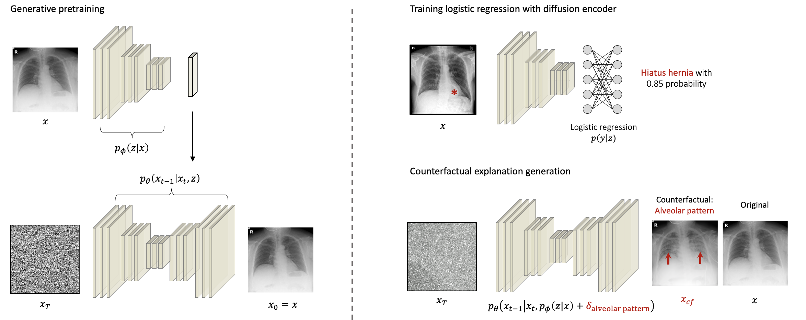

# Self-supervised diffusion pretraining for thoracic pathology detection offers insights into confounders


 ### Try a Colab demo: [](https://colab.research.google.com/drive/1gHWCQxreE1Olo2uQiXfSFSVInmiX85Nn?usp=sharing)

<p align="center">
    
</p>

### Prerequisites

See `requirements.txt`

```
pip install -r requirements.txt
```


### Pretrained models

We provide checkpoints for [**DiffChest**](https://drive.google.com/file/d/1CPw6FLqyafC-H2Ta3EfhpLWFqYE9Xd0j/view?usp=sharing) model trained on a joint collection of CXRs, namely, MIMIC-CXR (USA), CheXpert (USA), and PadChest (Spain).
In addition, we also offer [**latent statistics**](https://drive.google.com/file/d/1CQNiez_zVxX_9dLrK5z0NpuOZcvnJ-pr/view?usp=sharing) and the [**classifier**](https://drive.google.com/file/d/1CYwXQXzxc6ImKiQABBkOIv3umrke_HzH/view?usp=sharing) model finetuned on high-quality PadChest subset which was annotated by physicians.

Checkpoints ought to be put into a separate directory `checkpoints`. 
Download the checkpoints and put them into `checkpoints` directory. It should look like this:

```
checkpoints/
- padchest_autoenc
    - last.ckpt # DiffChest checkpoint
- padchest_autoenc_cls
    - last.ckpt # Finetuned logistic regression classifier
```


### Medical Imaging Datasets
Please register and download those publicly available CXR datasets:

- [MIMIC-CXR](https://physionet.org/content/mimic-cxr/2.0.0/)
- [CheXpert](https://stanfordmlgroup.github.io/competitions/chexpert/) 
- [PadChest](https://bimcv.cipf.es/bimcv-projects/padchest/) 

After downloading and preprocessing those images, you need to create a [**LMDB**](https://github.com/advimman/CIPS/blob/main/prepare_data.py) dataset for model training.


## Training
We provide scripts for training & evaluate DiffChest on the following datasets: MIMIC-CXR, CheXpert, and PadChest.

Note: Most experiment requires at least 3x 3090s during training the DPM models while requiring 1x 2080Ti during training the accompanying classification head. 


**PadChest: 256 $\times$ 256**

We only trained the DiffChest due to the high computation cost.
This requires 3x 3090s.
```
python run_padchest.py
```

After the previous stage, a classifier (for manipulation) can be trained using:
```
python run_padchest_cls.py
```

## Testing

We provide a testing script for evaluating the classification performance of DiffChest:
```
python test_padchest_cls.py
```

## Visual explanations 
To generate visual explanations described in our paper, run:
```
python manipulate.py
```

## Citing Us
If you use DiffChest, we would appreciate your references to [our paper](https://arxiv.org/abs/2309.17123v1).

## Issues
Please open new issue threads specifying the issue with the codebase or report issues directly to than@ukaachen.de.


## License
The source code for the site is licensed under the MIT license, which you can find in the `LICENSE` file.

## Acknowledgments

The official implementation of diffae model: https://github.com/phizaz/diffae

